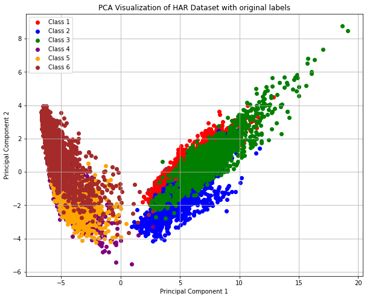

# ⚡ Fast and Simple Spectral Clustering (vs Classical Spectral Clustering)

This project implements and compares **Fast & Simple Spectral Clustering** (Macgregor et al., 2023) with **Classical Spectral Clustering** on the **HAR (Human Activity Recognition)** dataset. It leverages power method-based approximations to reduce computational cost while maintaining competitive clustering performance.

---

## 🚀 Project Summary

- Implemented both **Classical** and **Fast & Simple** Spectral Clustering algorithms
- Used **K-Means++** on spectral embeddings for final cluster assignment
- Applied clustering on the **HAR dataset** using a k-nearest neighbor similarity graph
- Evaluated clustering performance using **NMI** (Normalized Mutual Information), **ARI** (Adjusted Rand Index), and **runtime**
- Demonstrated that Fast Spectral Clustering achieves comparable performance **~2x faster**

---

## 🧠 Core Ideas

### Classical Spectral Clustering:
- Constructs a graph Laplacian
- Computes top-*k* eigenvectors
- Projects data to ℝᵏ
- Applies **K-Means++ (Lloyd’s algorithm)** for clustering

### Fast & Simple Spectral Clustering:
- Avoids full eigen decomposition
- Uses the **Power Method** for low-rank projection
- Projects data to **O(log(k))** dimensions
- Applies K-Means++ for final clustering

---

## 📂 Files Included

- `Fast and Simple Spectral Clustering algorithm with K-means++ clustering.ipynb` — Full implementation of the fast algorithm
- `Llyod's_Spect_clust.ipynb` — Classical spectral clustering with K-Means++
- `Report.pdf` — Detailed technical report, theory, code, comparisons, and results

---

## 📊 Results Overview

| **KNN Mode**     | **Metric**       | **FastSpectralCluster** | **ClassicSpectralCluster** |
|------------------|------------------|--------------------------|-----------------------------|
| **Connectivity** | NMI              | 0.4960                   | 0.6838 ↑                    |
|                  | ARI              | 0.3623                   | 0.4772 ↑                    |
|                  | Running time (s) | 16.1241 ↓                | 16.9588                     |
| **Distance**     | NMI              | 0.4942                   | 0.6796 ↑                    |
|                  | ARI              | 0.3571                   | 0.4745 ↑                    |
|                  | Running time (s) | 16.0628 ↓                | 16.7482                     |

> 🔍 **Legend:**  
> ↑ = better performance (higher NMI/ARI)  
> ↓ = faster (lower runtime) Algorithm         
> ✅ FastSpectralCluster achieves ~75–80% of clustering quality with significantly faster runtime.

---

## 📈 Visualizations (PCA Reduced)

- 📌 Clusters with true labels vs predicted clusters (Fast & Classic)
- 🟪 PCA plots show distinguishable cluster separation

### 📌 PCA of Ground Truth Labels:



### 📌 Fast Spectral Clustering Output:


### 📌 Classical Spectral Clustering Output:


> *Detailed report and visuals in `Report.pdf`, Section 4.2.2 (Figures 1–6)*

---

## ⚙️ How to Run

1. Clone the repo and open in Jupyter/Colab:
```bash
git clone https://github.com/your-username/fast-spectral-clustering.git
cd fast-spectral-clustering
```

2. Install dependencies:
```bash
pip install numpy pandas matplotlib scikit-learn
```

3. Run either notebook:
- `Fast and Simple Spectral Clustering algorithm with K-means++ clustering.ipynb`
- `Llyod's_Spect_clust.ipynb`

---

## 🛠 Tools Used

- Python (Jupyter Notebooks)
- NumPy, Pandas, Scikit-learn
- PCA, Power Method, KNN Graphs
- Metrics: NMI, ARI, Runtime

---

## 📘 References

- Macgregor et al. (2023), *A Tighter Analysis of Spectral Clustering* (ICML'22)  
- Golub & Van der Vorst (2000), *Eigenvalue Computation in the 20th Century*  
- Lloyd (1982), *Least Squares Quantization in PCM*  
- Scikit-learn & OpenML (HAR Dataset)

---

## 📩 Contact

Feel free to connect on [LinkedIn](https://www.linkedin.com/in/prannoy-k/) or reach out for collaboration or questions!
